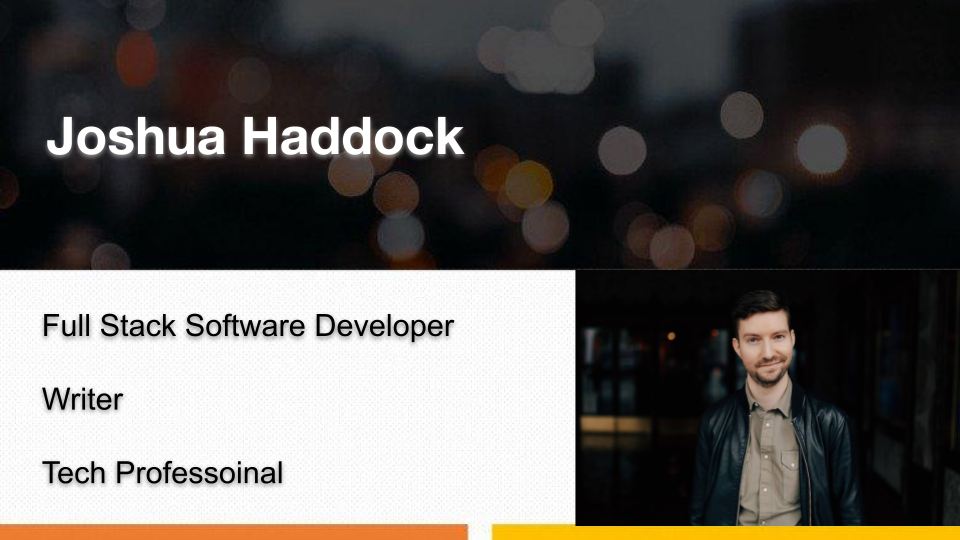

&nbsp;&nbsp;
&nbsp;&nbsp;
&nbsp;&nbsp;

<h2 align="center">Welcome!</h2>

--------

<h2>My Story</h2>

By early 2020 I'd spent years working at and running some of the best restaurants and bars in Seattle, and while parts of me loved the F&B industry I knew I wanted a change but wasn't sure how to transition my career. Suddenly in March of that year every bar and restaurant closed it's doors and I had all the free time in the world to sit and think about exactly what I wanted.

While trying to work out what my big move would be I remembered a conversation I had had with a regular when I was tending bar. I mentioned that I was in awe of the things he did but I could never do them, my brain just didn't work like that. He told me I was wrong, my brain could work like that if I wanted it to, I just had to put in the time and have enough grit to keep trying.

So I put him to the test and took a coding class online. I found that after just a few classes that I was obsessing over my code, and that every time I was able to write a functional algorithm I would get a little jolt of adrenaline and excitement. The more I studied, the more I got interested in the nitty gritty of how things worked and I kept finding myself going down these endless rabbit holes which was overwhelming but also empowering, and somewhere down in one of those rabbit holes, after I wrote my first few functional applications, I knew that this was what I wanted to do, and I went all in. In early 2021 I enrolled in an accelerated software development program at Code Fellows, and in September of 2021 I graduated with a countless new tools, frameworks, and languages I can now use to build the kinds of applications I only used to dream about.

--------

<h2>Developer</h2>

I studied Full Stack Developement at Code Fellows with a focus on C#. I am intrigued by server architecture, data management, and scalable systems; but I also love making beautiful and intuitive front-end. When I want to play around with code you can find me in Unity playing with gaming mechanics and phsyics engines or practicing my data structures and algorithms in LeetCode.

**My Languages**

C#, JavaScript, CSS, HTML, SQL, Bash, PowerShell

**Skills and Tools**

.NET Core, Entity Framework, MVC, Razor Pages, React, React-Bootstrap, Git, VS Code, Visual Studio, MongoDB, Axios, Heroku, Netlify, Node.js, Auth0, Expresss, Azure DevOps, Azure SQL, Unity

-------

<h2> Professinal Competencies </h2>

1. Communication: Writing Proficiency
    * Extensive background in numerous styles of writing.
    * Ability to explain complex subjects simply.
    * BA in Creative Writing, minors in History and Theater.

2. Growth Mindset: Constant Improvement Proficiency
    * Curious, never content to know just enough.
    * Autodidactic, I will teach myself and find ways to learn.
    * Always looking to expand, never willing to coast.

3. Leadership Competency: Accountability
    * Acknowledging and owning my mistakes.
    * Creating due dates and clear goals for myself and my team.
    * Being aware of and admitting personal limitations.

--------

<h2>What I'm Doing</h2>

* [LeedCode : 75 Must Do Problems](https://leetcode.com/list?selectedList=9291fdy7)
* [The Odin Project](https://www.theodinproject.com/)
* [C# Data Access](https://www.youtube.com/watch?v=Et2khGnrIqc&list=PLLWMQd6PeGY3b89Ni7xsNZddi9wD5Esv2)

--------

<h2>Where I'm Going</h2>

* [Data Structures Meetup](https://www.meetup.com/techinterviews/events/281942574)

* [Kode Katas](https://www.meetup.com/seattlejshackers/events/nwkrcsyccpbvb/)

* [Thinkful Webinar "What is UX/UI Design?"](https://www.meetup.com/Learn-to-Code-Thinkful-Seattle/events/281361234)

--------

<h2>Resources</h2>

- Social media favicons from <a href="https://icons8.com">Icons8</a>

- <a href="https://towardsdatascience.com/build-a-stunning-readme-for-your-github-profile-9b80434fe5d7">Build a Stunning README For Your GitHub Profile</a>

- <a href="https://sarah-hart-landolt.medium.com/6-easy-steps-to-create-a-beautiful-github-profile-readme-edc7840b2c7">6 Easy Steps to Create a Beautiful GitHub Profile README</a>

- <a href="https://docs.github.com/en/github/setting-up-and-managing-your-github-profile">Setting up and managing your GitHub profile
</a>

<!--
**joshhaddock88/joshhaddock88** is a ✨ _special_ ✨ repository because its `README.md` (this file) appears on your GitHub profile.

Here are some ideas to get you started:

- 🔭 I’m currently working on ...
- 🌱 I’m currently learning ...
- 👯 I’m looking to collaborate on ...
- 🤔 I’m looking for help with ...
- 💬 Ask me about ...
- 📫 How to reach me: ...
- 😄 Pronouns: ...
- ⚡ Fun fact: ...
-->
